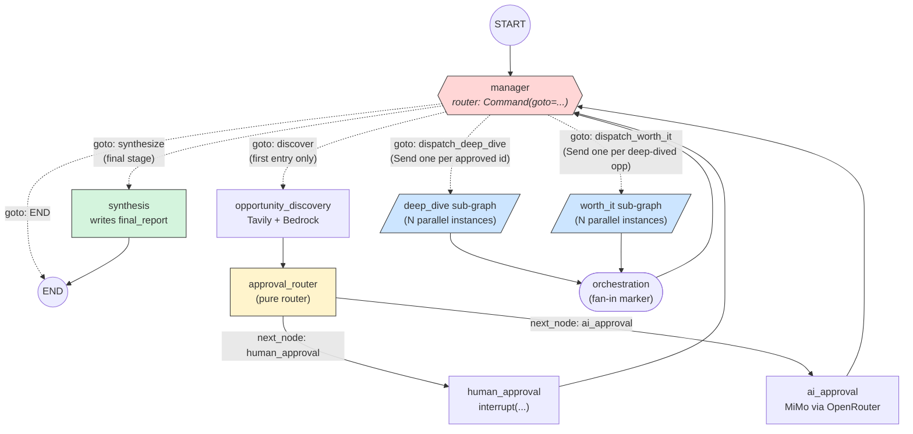

# Research Agent — Graph Architecture

This document explains how the nodes in `graph/nodes/` fit together and
why each one exists. The diagram below is the source of truth for the
topology wired up in `graph/builder.py`.

## Role of each node

| Node | Role | When it runs |
|---|---|---|
| `manager` | **Orchestrator / supervisor.** A router node — inspects state and returns `Command(goto=...)` to pick the next step. The *only* place that emits `Send()` to dispatch parallel sub-agents. | Every time the graph re-enters it (start, after approval, after fan-in) |
| `opportunity_discovery` | Runs Tavily + Bedrock to surface 3–5 candidate opportunities. | First call from `manager` |
| `approval_router` | Pure router: returns `{"next_node": "human_approval" \| "ai_approval"}` based on `state["hitl_mode"]`. No side effects. | Right after `opportunity_discovery` |
| `human_approval` | Calls `interrupt({...})` so a human can pick which opportunities to deep-dive. Writes chosen IDs into `state["approved_opportunity_ids"]`. | When `hitl_mode == "human"` |
| `ai_approval` | Asks Xiaomi MiMo (via OpenRouter) to pick which opportunities to deep-dive. Writes chosen IDs into `state["approved_opportunity_ids"]`. | When `hitl_mode == "ai"` |
| `deep_dive` | **Compiled sub-graph** — one `deep_dive_subagent` per opportunity, fanned out in parallel via `Send()`. Each instance enriches one `Opportunity` with existing-solution research and trend notes. | After approval, dispatched by `manager` |
| `orchestration` | **Fan-in marker.** The placeholder successor after a parallel sub-graph finishes, so the merged state re-enters the `manager`. No real business logic. | After every parallel sub-graph (deep_dive, worth_it) |
| `worth_it` | **Compiled sub-graph** — one `worth_it_subagent` per opportunity in parallel. Each instance stamps `worth_it_verdict` and `worth_it_reasoning` onto one `Opportunity`. | After deep_dive fan-in, dispatched by `manager` |
| `synthesis` | **Terminal node.** Reads the final opportunities dict (keyed by `Opportunity.id`) and writes `state["final_report"]`. | Last call from `manager` |

## Why three different "supervisor-ish" nodes?

It's tempting to fold `manager`, `orchestration`, and `synthesis` into one
file, but LangGraph forces them apart:

- **`manager`** has to be a **router**: it returns `Command(goto=...)`,
  which means it chooses the next node at runtime. That's a distinct
  node contract.
- **`orchestration`** isn't actually doing orchestration — it's the
  required **fan-in successor**. When you fan out N parallel instances
  of a node (or sub-graph), LangGraph needs *one* single successor to
  re-enter the main flow. Without `orchestration`, the builder has
  nowhere to connect the parallel branch back into `manager`. The
  actual orchestration logic still lives in `manager`; this node just
  bridges the edge.
- **`synthesis`** is the **terminal leaf**. The graph ends here, so it
  must be its own node (no outgoing edges). It can't be merged into
  `manager` because `manager` needs a `Command(goto=...)` at the end
  to reach `END` — easier to give synthesis its own static edge to
  `END`.

## Diagram

Solid arrow = static edge. Dashed arrow = `Command(goto=...)` from the
manager. Double-line box = compiled sub-graph. Cloud shape = external
service.

## Lifecycle of a single run

1. Caller invokes the graph with `domain` + `hitl_mode` in initial state.
2. `manager` runs first (entry from `START`) — sees `opportunities` is
   empty → `goto opportunity_discovery`.
3. `opportunity_discovery` runs, populates `opportunities` with 3–5
   candidate items keyed by `Opportunity.id`.
4. `manager` runs again → `goto approval_router`. `approval_router`
   returns `{"next_node": "human_approval" | "ai_approval"}` based on
   `hitl_mode`.
5. The chosen approval node writes `approved_opportunity_ids` into state.
6. `manager` runs again → emits `Send()` calls (one per approved id) to
   the `deep_dive` sub-graph. LangGraph runs them in parallel; each
   inner node returns `{"opportunities": {id: updated}}` and the
   parent's **merge-by-id reducer** on `opportunities` coalesces the N
   parallel writes into a single dict (no duplicates).
7. `orchestration` runs as the fan-in marker (validates completeness),
   then back to `manager`.
8. `manager` runs again → emits `Send()` to the `worth_it` sub-graph,
   one per deep-dived opportunity. Parallel again, same merge-by-id
   contract — each inner node returns a single-key dict fragment.
9. `orchestration` runs again, then back to `manager`.
10. `manager` runs one final time → `goto synthesis`.
11. `synthesis` writes `final_report`, graph ends.

### Merge contract for `opportunities`

`state["opportunities"]` is a `dict[str, Opportunity]` (not a list) so
that N parallel sub-agent writes can coexist without producing duplicate
records. The reducer in `graph/state.py` (`_merge_opportunities_by_id`)
merges writes by `Opportunity.id`, with later writes winning for any
given id. Dict insertion order is preserved across updates (Python's
`dict.update` on an existing key keeps the original position), so
synthesis iterates in first-discovery order with updates filled in.

The **only node that runs more than once** is `manager` — every other
node runs at most once per stage. `orchestration` runs twice (after
each parallel sub-graph). `synthesis` runs once at the end.